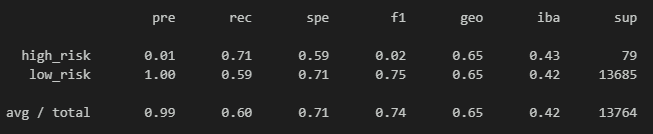
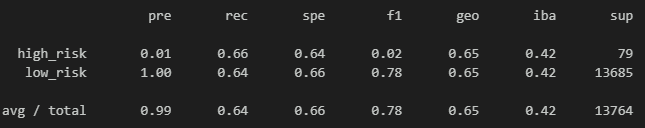
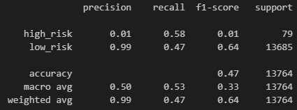
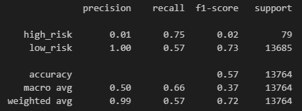
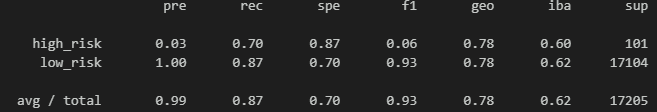
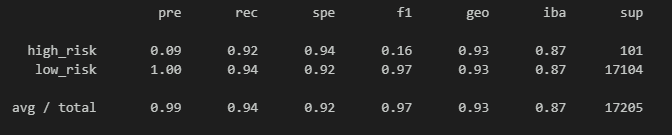

# Credit_Risk_Analysis

## Overview
The purpose of this analysis is to apply machine learning techniques to predict credit card risk using the credit card credit dataset from LendingClub. As credit risk is an unbalanced classification problem, different resampling techniques including oversampling, undersampling, and a combination of both have been applied using the imbalanced-learn library. Additionally, two new machine learning models, BalancedRandomForestClassifier and EasyEnsembleClassifier, have been used to reduce bias in the predictions.

## Analysis
* ### Naive Random Oversampling
Balanced Accuracy Score: 0.6518362986361304

* ### SMOTE Oversampling
Balanced Accuracy Score: 0.6514741724978379

* ### Central Centroids
Balanced Accuracy Score: Balanced Accuracy Score: 0.5281505667759674

* ### SMOTEENN
Balanced Accuracy Score: 0.5281505667759674

* ### Balanced Random Forest Classifier
Balanced Accuracy Score: 0.7885466545953005

* ### Easy Ensemble AdaBoost Classifier
Balanced Accuracy Score: 0.9316600714093861

## Summary
Based on the performance of the machine learning models, the EasyEnsembleClassifier outperforms the other models in terms of balanced accuracy score, precision, and recall. It shows the highest balanced accuracy score of 0.931, and the highest recall scores for both high-risk and low-risk classes, indicating better prediction performance. Therefore, the EasyEnsembleClassifier is recommended for predicting credit risk in this analysis. The BalancedRandomForestClassifier also performs well with a balanced accuracy score of 0.788 and relatively high recall scores, but it is outperformed by the EasyEnsembleClassifier. Other models, including RandomOverSampler, SMOTE, ClusterCentroids, and SMOTEENN, show lower performance in terms of balanced accuracy and recall scores, indicating lower prediction performance for credit risk.
